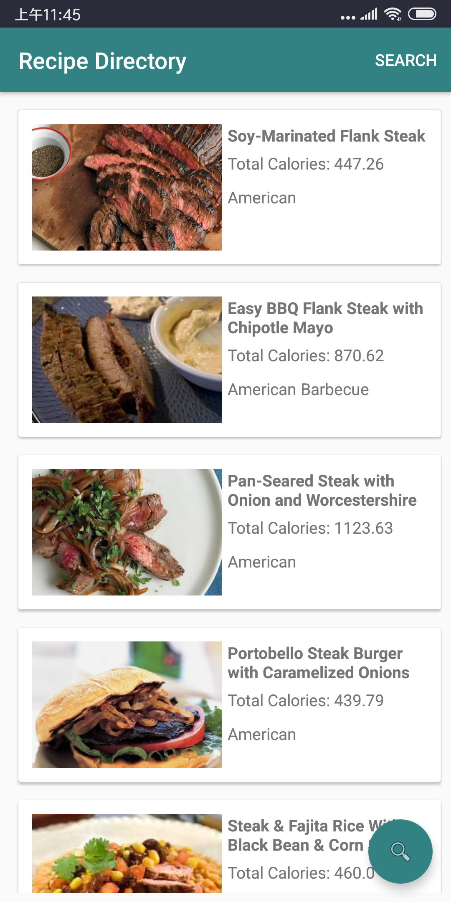
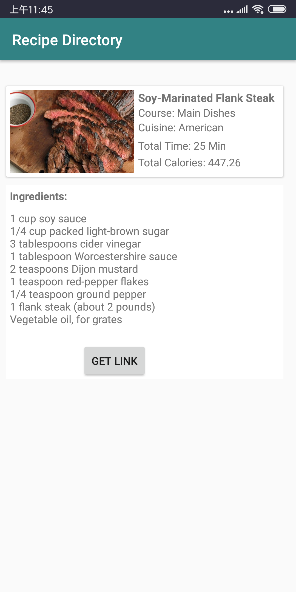

# Android Recipe Search Engine (Backend)

*	An Android App allows you to search recipe with key words and calories, deliver nutrition-based recipes.
*	Scraped about 125,000 recipes from various food websites, stored recipe images on AWS S3

*	Front end: Mobile App (Android 9.0); 
*	Back end: Spring Boot; 
*	Database: MongoDB; 
*	Deployment: AWS EC2

## App Demo

Here is the link of backend!
[Android frontend](https://github.com/szcpitt/Android-Recipe-Search-Engine)